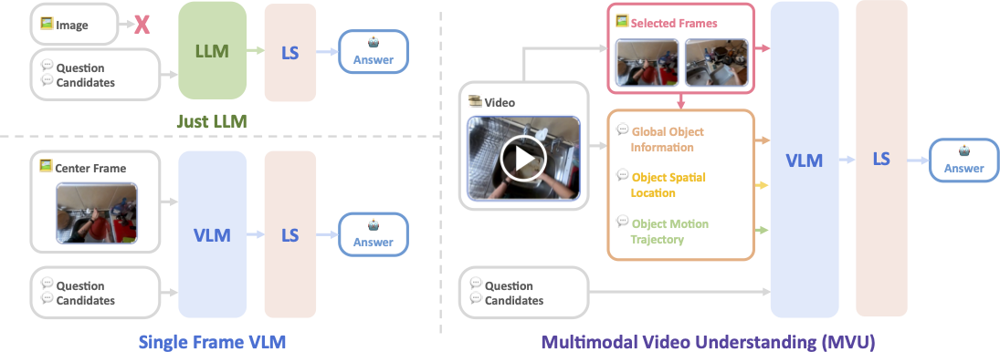

# Understanding Long Videos in One Multimodal Language Model Pass

[Kanchana Ranasinghe](https://scholar.google.com/citations?user=K2WBZTwAAAAJ&hl=en),
[Xiang Li](https://scholar.google.com/citations?user=qkyC7KQAAAAJ&hl=en),
[Kumara Kahatapitiya](https://scholar.google.com/citations?user=ExGkzjQAAAAJ&hl=en), 
[Michael Ryoo](https://scholar.google.com/citations?user=vcw0TJIAAAAJ&hl=en)

**[Paper Link]()** | **[Project Page](https://kahnchana.github.io/mvu)** 


## Overview
> **Abstract:**
>*Large Language Models (LLMs), known to contain a strong awareness of world knowledge, have allowed recent approaches to achieve excellent performance on Long-Video Understanding benchmarks, but at high inference costs. 
In this work, we first propose Likelihood Selection, a simple technique that unlocks faster inference in autoregressive LLMs for multiple-choice tasks common in long-video benchmarks.
In addition to faster inference, we discover the resulting models to yield surprisingly good accuracy on long-video tasks, even with no video specific information. 
Building on this, we inject video-specific object-centric information extracted from off-the-shelf pre-trained models and utilize natural language as a medium for information fusion. Our resulting Multimodal Video Understanding (MVU) framework demonstrates state-of-the-art performance across long-video and fine-grained action recognition benchmarks.*

<p align="center">
  
</p>
<p align="center">
We propose three variants of our framework. (left-top) Just LLM only world knowledge with zero task-specific awareness. (left-right) Single Frame VLM processes an additional center frame to obtain task context but accesses no video specific information. (right) Our complete approach, MVU extracts three additional object-centric modalities followed by fusion in language space. LS refers to likelihood selection. 
</p>


## Quickstart 

We provide two notebooks to explore our two modality-constrained variants. These models require only an LLM / VLM to operate and can be setup easily. 

* LLM Only: [notebook](notebooks/llm_only.ipynb) 
* Single Frame VLM: [notebook](notebooks/sf_vlm.ipynb) 

The following results can be replicated using our notebooks.
| Method   |       Backbone      | Acc (%) | Time (s) |
|----------|:-------------------:|:-------:|:--------:|
| LLM Only |   Llama-2-7b-Chat   |   17.4  |   0.89   |
| LLM Only |     Gemma-7b-IT     |   45.8  |   2.38   |
| LLM Only | Mistral-7B-Instruct |   45.8  |   0.41   |
| SF-VLM   |    LLaVA-v1.5-13B   |   55.8  |   1.70   |

Our full MVU framework requires EgoSchema videos for inference and involves multiple pretrained models. Refer to next section for using it. 

## Installation 

1. Clone our repository
   ```
   git clone https://github.com/kahnchana/mvu.git
   ```
2. Create conda environment
    ```
    conda create -n mvu python=3.8
    conda activate mvu
    ```
3. Install python dependencies
    ```
    pip install -r requirements.txt
    ```

## Dataset Preparation
Our main evaluations utilize three datasets: EgoSchema, NextQA, and Open X-Embodiment. We direct to their websites for dataset setup. 

1. [EgoSchema](https://github.com/egoschema/EgoSchema)
2. [NextQA](https://github.com/doc-doc/NExT-QA)
3. [Open X-Embodiment](https://github.com/google-deepmind/open_x_embodiment)

We follow the default instructions in their websites to download these datasets. We describe the dataset splits used for each evaluation in our paper. 


## MVU Framework

We now detail our MVU framework. This is built over the Single Frame VLM variant. 

### Frame Selection 

```
python model_frame_selection.py
```

### Object Centric Modalities
We provide the pre-extracted data for each modality along with the templates used for language based fusion.
These will be automatically download in the following scripts. 

### Long Video QnA
Modify the name of the dataset (EgoSchema, NextQA) and the data root (directory where the dataset was downloaded).
```
python model_video_infer.py --dataset $DATASET --data-root $DATA_ROOT
```


## References
Our work builds over the [LLaVA codebase](https://github.com/haotian-liu/LLaVA/tree/main) and utilizes multiple pretrained models from [HuggingFace](https://huggingface.co) (HF).  From HF, we use three different LLMs: [Mistral-7B](https://huggingface.co/mistralai/Mistral-7B-Instruct-v0.2), [LLAMA-2-7B](https://huggingface.co/meta-llama/Llama-2-7b-chat-hf), and [Gemma-7B](https://huggingface.co/google/gemma-7b-it). We also use [OWL-ViT](https://huggingface.co/google/owlvit-base-patch32) for object detection. We thanks all authors and maintainers of all above codebases for their open-source contributions.

## Citation
If you find our work or code useful, please consider citing our paper and leaving a star on our repo. 
```
@misc{rana2024mvu,
      title={Understanding Long Videos in One Multimodal Language Model Pass}, 
      author={Kanchana Ranasinghe and Xiang Li and Kumara Kahatapitiya and Michael Ryoo},
      year={2024},
}
```
